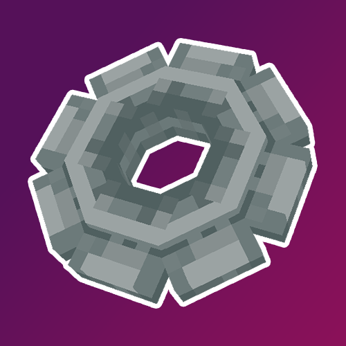
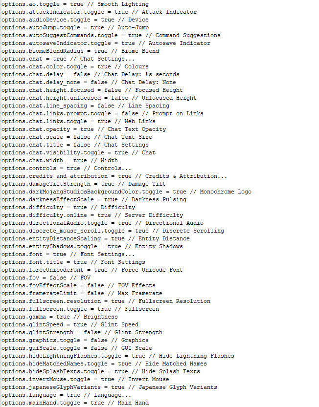
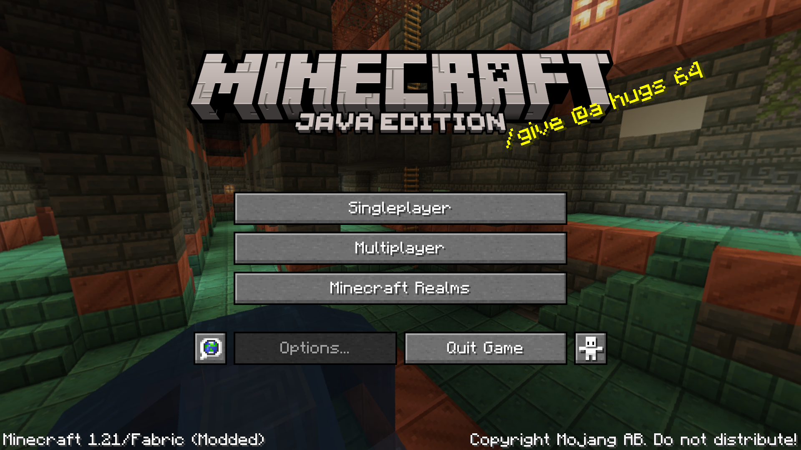
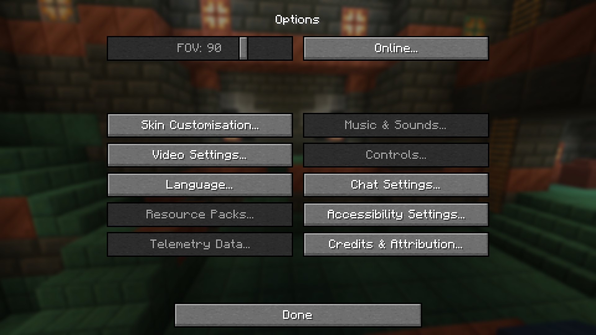
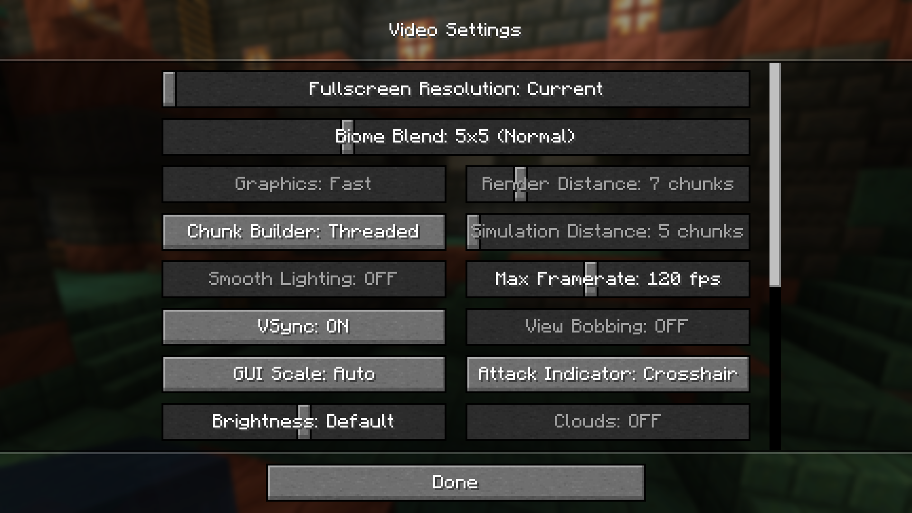
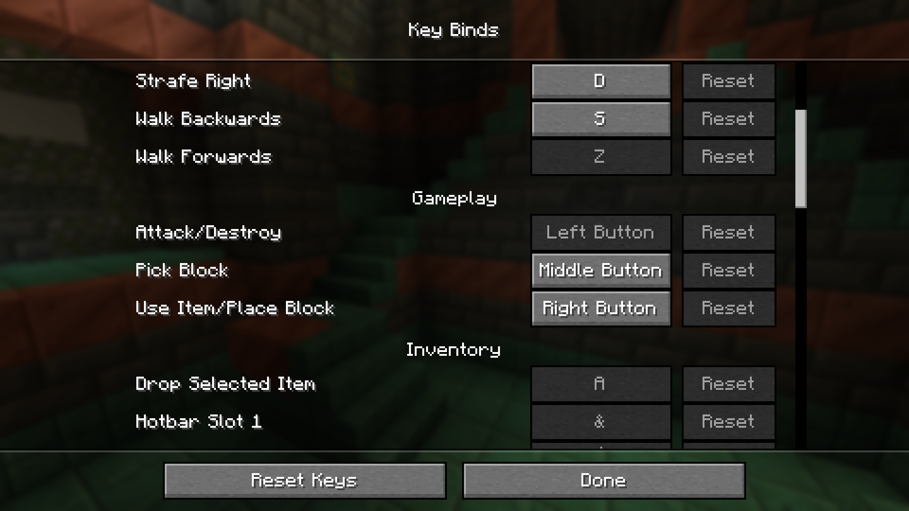

# ClouserSettingsLocker

This mod allows to lock precise settings to prevent breaking Clouser's Minecraft maps.

    
    
    

# Features

## Lock settings

This mod generates a file in the main Minecraft folder, named settingsLock.txt.

Editing this file allows to enable and disable options. You don't need to restart the game, the changes are loaded in runtime and you just have to reopen the menu to apply the modifications.

Below is an example line from the file:

`options.fov = true // FOV`

Let's break this line down, shall we?

| `options.fov`                            | `=` | `true`                                                                          | `//` | `FOV`                                                              |
|------------------------------------------|-----|---------------------------------------------------------------------------------|------|--------------------------------------------------------------------|
| A code for the targeted option or button |     | If this value is `true`, the option is enabled. If it's `false`, it's disabled. |      | The in-game english name of the option. Here, it's the FOV slider. |

Here are some examples:

| The fully disabled option menu                | Some settings disabled                     | Some graphics settings disabled                | You can even prevent keybinds modification!    |
|-----------------------------------------------|--------------------------------------------|------------------------------------------------|------------------------------------------------|
|  |  |  |  |

## Commands

### /keybind
The keybind command changes the targeted keybind on the specified players.
#### Syntax:
- `/keybind [player] <binding> set <key>`
  Sets the targeted binding to the specified key.
- `/keybind [player] <binding> (reset|unbind)`
  Resets or unbinds the targeted binding.
#### Examples:
| Command                                | Description                                             |
|----------------------------------------|---------------------------------------------------------|
| `/keybind key.jump set key.keyboard.z` | Sets the player's jump key to the z key                 |
| `/keybind @a key.forward reset`        | Resets all players' forward keys                        |
| `/keybind @p key.smoothCamera unbind`  | Unbinds the cinematic camera key for the nearest player |

### /lockSettings
The lockSettings command allows to lock and unlock specified settings on specified players.
#### Syntax:
- `/lockSettings [player] <option> <unlocked>`
  Locks or unlocks the targeted option for the targeted player
#### Examples:
| Command                             | Description                             |
|-------------------------------------|-----------------------------------------|
| `/lockSettings options.title false` | Locks the entire player's settings menu |
| `/lockSettings @a key.drop true`    | Unlocks drop key change for all players |

# License and credits

This mod is open-source and copyrighted under MIT licence. Full license [here](LICENSE).

